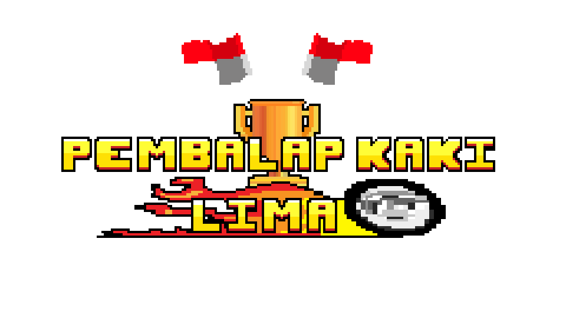
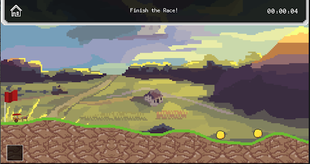

<div id="top"></div>
<!-- PROJECT SHIELDS -->
<!--
*** I'm using markdown "reference style" links for readability.
*** Reference links are enclosed in brackets [ ] instead of parentheses ( ).
*** See the bottom of this document for the declaration of the reference variables
*** for contributors-url, forks-url, etc. This is an optional, concise syntax you may use.
*** https://www.markdownguide.org/basic-syntax/#reference-style-links
-->
<!-- [![Contributors][contributors-shield]][contributors-url]
[![Forks][forks-shield]][forks-url]
[![Stargazers][stars-shield]][stars-url]
[![Issues][issues-shield]][issues-url]
[![MIT License][license-shield]][license-url] -->
<!-- [![LinkedIn][linkedin-shield]][linkedin-url] -->


<!-- PROJECT LOGO -->
<br />
<div align="center">
  <a href="https://github.com/GiantSweetroll/Construct2-Race-HCI">
    
  </a>

  <h3 align="center">Pembalap Kaki Lima</h3>

  <p align="center">
    A side-scrolling racing game revolving around the theme of Indonesia
    <!-- <br />
    <a href="https://github.com/othneildrew/Best-README-Template"><strong>Explore the docs »</strong></a> -->
    <!-- <br />
    <br />
    <a href="https://github.com/othneildrew/Best-README-Template">View Demo</a>
    ·
    <a href="https://github.com/othneildrew/Best-README-Template/issues">Report Bug</a>
    ·
    <a href="https://github.com/othneildrew/Best-README-Template/issues">Request Feature</a> -->
  </p>
</div>


<!-- TABLE OF CONTENTS -->
<details>
  <summary>Table of Contents</summary>
  <ol>
    <li>
      <a href="#about-the-project">About The Project</a>
      <ul>
        <li><a href="#built-with">Built With</a></li>
      </ul>
    </li>
    <li>
      <a href="#getting-started">Getting Started</a>
      <ul>
        <li><a href="#prerequisites">Prerequisites</a></li>
        <li><a href="#installation">Installation</a></li>
      </ul>
    </li>
    <li><a href="#usage">Usage</a></li>
    <!-- <li><a href="#roadmap">Roadmap</a></li> -->
    <!-- <li><a href="#contributing">Contributing</a></li> -->
    <!-- <li><a href="#license">License</a></li> -->
    <li><a href="#members">Members</a></li>
  </ol>
</details>


<!-- ABOUT THE PROJECT -->
## About The Project

<div align="center">
    
</div>

Pembalap Kaki Lima is a side-scrolling racing game revolving around the theme of Indonesia. The vehicles the player can control, the obstacles they have to face, and the terrain revolved around that as well. The of the game is to reach the finish line as fast as possible, while also collecting as many coins as they can. There are obstacles and powerups the player can interact with along the track.

Players can take control of three types of vehicles:
* Motor bebek
* Mobil Esemka
* Delman


There are two maps the player can play on: City or Rural. The city takes inspiration from the city of Jakarta, while the rural area takes inspiration from the countryside.  

There are several obstacles the player can interact with along the course:
* Flood
* Earthquake
* Beggar
* Smog

The player can also get an Indomie powerup to get a speedboost by interacting with a Lucky Box.

<div align="right">(<a href="#top">back to top</a>)</div>


### Built With

This project was created using [Construct2](https://www.construct.net/en/construct-2/download).

<div align="right">(<a href="#top">back to top</a>)</div>


<!-- GETTING STARTED -->
## Getting Started

To get a local copy of the project up and running instead, follow these simple steps.

### Prerequisites

[Construct2](https://www.construct.net/en/construct-2/download)

### Installation

1. Clone the repo
   ```sh
   git clone https://github.com/GiantSweetroll/Construct2-Race-HCI.git
   ```
2. Open `IndoRacecar.caproj` using Construct2.

<div align="right">(<a href="#top">back to top</a>)</div>


<!-- USAGE EXAMPLES -->
## Usage

To view how to use the game, refer to this [video](https://www.youtube.com/watch?v=niaO2FRXUoE).

<div align="right">(<a href="#top">back to top</a>)</div>


<!-- MEMBERS -->
## Members

- [Aric Hernando](https://github.com/Aric-prog)
- [Bently Edyson](https://github.com/bentlyedyson)
- [Gardyan Akbar](https://github.com/GiantSweetroll)

Project Link: [https://github.com/GiantSweetroll/Construct2-Race-HCI](https://github.com/GiantSweetroll/Construct2-Race-HCI)

<div align="right">(<a href="#top">back to top</a>)</div>


<!-- MARKDOWN LINKS & IMAGES -->
<!-- https://www.markdownguide.org/basic-syntax/#reference-style-links -->
<!-- [contributors-shield]: https://img.shields.io/github/contributors/othneildrew/Best-README-Template.svg?style=for-the-badge
[contributors-url]: https://github.com/othneildrew/Best-README-Template/graphs/contributors
[forks-shield]: https://img.shields.io/github/forks/othneildrew/Best-README-Template.svg?style=for-the-badge
[forks-url]: https://github.com/othneildrew/Best-README-Template/network/members
[stars-shield]: https://img.shields.io/github/stars/othneildrew/Best-README-Template.svg?style=for-the-badge
[stars-url]: https://github.com/othneildrew/Best-README-Template/stargazers
[issues-shield]: https://img.shields.io/github/issues/othneildrew/Best-README-Template.svg?style=for-the-badge
[issues-url]: https://github.com/othneildrew/Best-README-Template/issues -->
<!-- [license-shield]: https://img.shields.io/github/license/othneildrew/Best-README-Template.svg?style=for-the-badge -->
<!-- [license-url]: https://github.com/othneildrew/Best-README-Template/blob/master/LICENSE.txt
[linkedin-shield]: https://img.shields.io/badge/-LinkedIn-black.svg?style=for-the-badge&logo=linkedin&colorB=555
[linkedin-url]: https://linkedin.com/in/othneildrew -->
<!-- [product-screenshot]: images/screenshot.png -->
